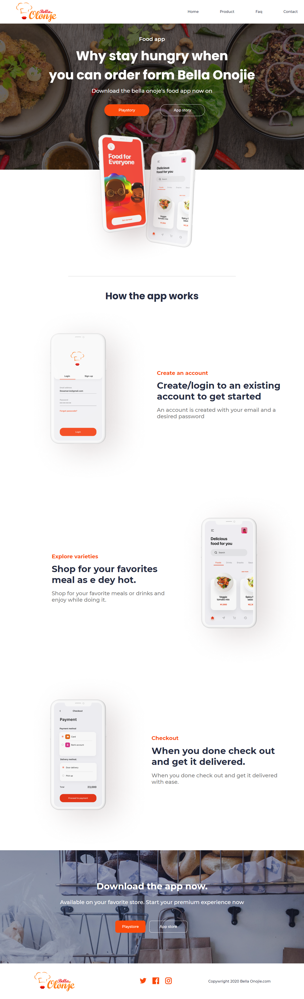

<h1 align='center'> Clone de UI </h1>


A aplicação baseia-se na utilização de um projeto free disponivel no **figma**, é um clone da página Home versão Desktop. 

### 🛠 Tecnologias

As seguintes ferramentas foram usadas na construção do projeto:

- [HTML](https://developer.mozilla.org/pt-BR/docs/Web/HTML)
- [CSS](https://www.w3schools.com/css/)
- [TypeScript](https://www.typescriptlang.org/)
- [React.JS](https://pt-br.reactjs.org/)
- [Next.JS](https://nextjs.org/)
- [Layout - Figma](https://www.figma.com/file/FiLwluMGZmTiuI2CXyDs97/Food-delivery-app-Ui-kit-(Community)?node-id=126%3A233)


### Pré-requisitos

Antes de começar, você vai precisar ter instalado em sua máquina as seguintes ferramentas:
[Git](https://git-scm.com), [Node.js](https://nodejs.org/en/). 
Além disto é bom ter um editor para trabalhar com o código como [VSCode](https://code.visualstudio.com/)

### 🎲 Como executar

```bash
# Clone este repositório
$ git clone https://github.com/joaoygo/nlw-04
$ cd nlw-04

# Instale as dependências com yarn
$ yarn add

# Start the project
$ yarn dev

# A aplicação inciará na porta:3000 - acesse <http://localhost:3000>
```


<h4 align="center"> 
	🚀 FINALIZADO 🚀
</h4>